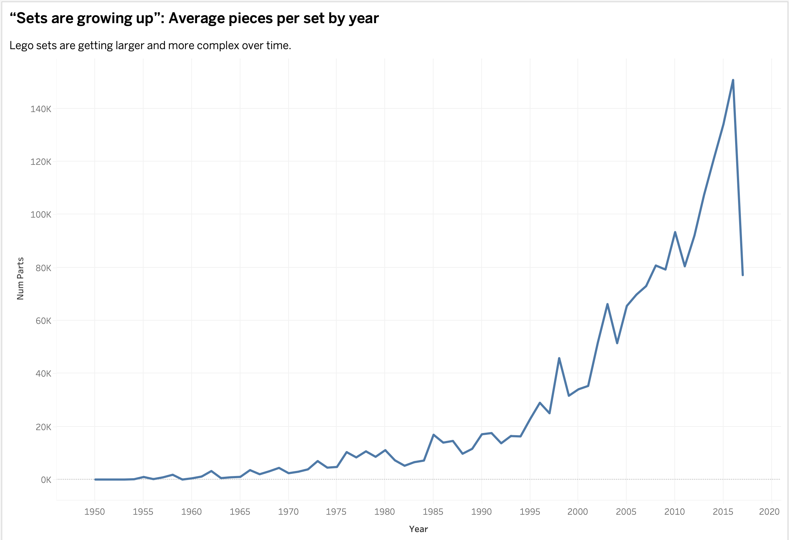
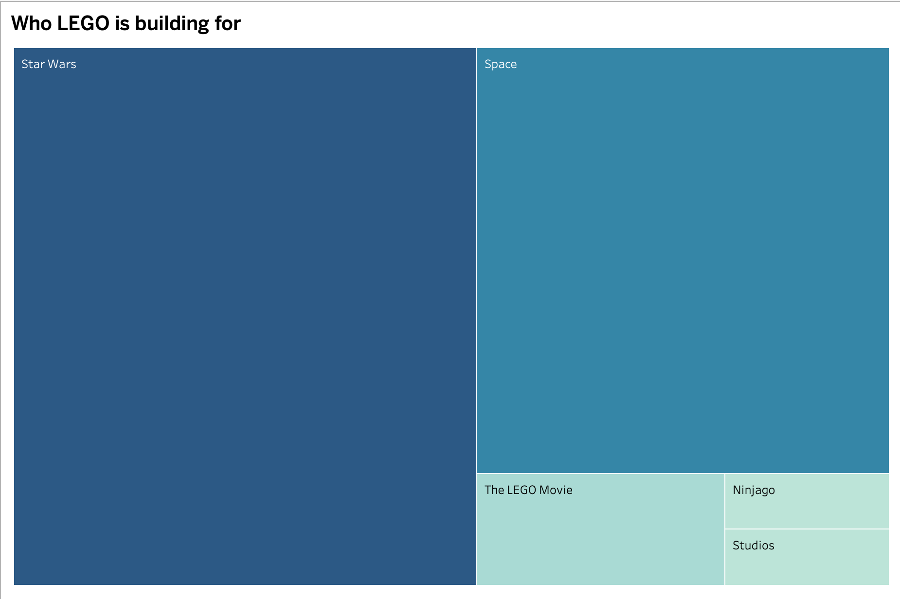

# 🧱 How Lego grew up: An Analysis of LEGO’s Product Evolution 
**Vishakha Pathak**  
*Fall 2025 | Final Project Part I*

---

## 🧩 High-Level Summary

LEGO exists in collective memory as the ultimate simple toy: a handful of bright primary colors, highly standardized bricks, and the feeling that creativity flows from constraints. But once we look at the historical LEGO dataset, a different picture emerges—one that shows a company undergoing a dramatic, deliberate evolution. Over the last seven decades, LEGO shifted from producing small, modular playsets for children to designing intricate, display-oriented models that rival architectural kits and film replicas.

This project examines the **evolution of complexity** within LEGO’s ecosystem using a dataset of more than 11,000 sets and their corresponding part inventories. This evolution is not subtle: sets grow exponentially in size, colors diversify beyond anything in the early palette, and licensed franchises begin to dominate the catalog. These changes reflect how LEGO responded to competitive pressures, particularly the rise of digital entertainment, by creating deeper, more detailed physical experiences.

**The central question:**  
How did LEGO transform from a minimalist children’s toy into a complex, collectible medium that appeals just as much—if not more—to adults?

My working argument is that LEGO’s evolution is driven by a fundamental audience shift. Complexity increases when the target shifts from the *Child Builder*, who needs speed and playability, to the *Adult Collector*, who values realism, detail, and thematic depth.

---

## 🏗️ Project Structure & Story Arc

To communicate this evolution clearly, I’ve structured the narrative into three acts inspired by concepts from *Good Charts*. Each act encapsulates a major transition in LEGO’s design philosophy and product strategy.

### **Act I: The Era of Standardization (1950–1990)**  
For roughly four decades, LEGO intentionally held back. Sets were small and predictable, often under 100 pieces, and the color palette consisted of only the essential hues. This restraint was strategic: it enabled a coherent “System of Play,” where every piece was compatible and endlessly reusable. During this era, LEGO prioritized uniformity and imagination over realism or storytelling.

**Visualization:**  
A nearly flat line in the “Average Parts per Set” metric highlights this phase of intentional simplicity.

---

### **Act II: The Complexity Explosion (1995–2010)**  
The late 1990s marked a turning point. As video games surged in popularity and children’s preferences shifted, LEGO began rethinking what physical toys could offer that screens couldn’t. This period saw the introduction of specialized elements, refined building techniques, and, significantly, a wave of new colors that supported realism. Sand Green, Light Bluish Gray, Dark Tan, Maersk Blue—these shades didn’t exist in the early palette but became essential for building lifelike models.

This era represents LEGO’s first major push toward aesthetic fidelity, signaling a departure from the uniformity of Act I.

**Visualization:**  
The “Color Distribution Timeline” shows a sudden increase in new colors introduced per year, visually illustrating the shift from basic play to detailed representation.

---

### **Act III: The Franchise Era (2011–Present)**  
LEGO’s modern catalog is shaped decisively by cinematic universes and adult-driven fandom. The complexity introduced in Act II becomes the foundation for massive display sets like the 7,541-piece Millennium Falcon or the intricately detailed modular buildings. Themes like Star Wars, The LEGO Movie, Marvel, and Ninjago dominate the product landscape, reflecting a shift toward world-building and collectible experiences.

This period also coincides with LEGO’s formal embrace of the AFOL (Adult Fans of LEGO) community through targeted marketing, premium sets, and nostalgia-driven releases.

**Visualization:**  
A treemap highlights the overwhelming presence of IP-based themes—especially Star Wars—compared to earlier original themes.

---

## 🎨 Initial Sketches & Visualizations

These initial visualizations serve as both analytical starting points and narrative anchors. They helped confirm which trends were strong enough to build a story around.

### **Figure 1: The Growth of Scale**  
*Chart type:* Time-series line chart  
*Trend:* The data shows a steady, almost flat pattern from 1950–1995, followed by a sharp upward bend. from the early 2000s onward, average set size rises quickly, and by the mid-2010s, large, detailed sets become the norm.  
*Interpretation:* These increases align not only with new product lines (e.g., Creator Expert) but also with LEGO’s broader strategic shift toward premium, collectible products designed for older builders.

---

### **Figure 2: The Explosion of Color**  
*Chart type:* Dot plot / Gantt-style timeline  
*Trend:* Early decades feature long horizontal stretches where no new colors appear. Beginning in the late 1990s, the timeline becomes exponentially denser, signaling a period of rapid color experimentation and expansion.  
*Interpretation:* These colors support narrative-specific worlds: muted grays for sci-fi ships, earthy tones for architecture, and nuanced hues for character replicas. The palette expansion is not aesthetic decoration; it is a functional requirement for faithful world-building.

---

### **Figure 3: The Dominance of IP**  
*Chart type:* Treemap  
*Trend:* A few dominant blocks—Star Wars and Space—anchor the visual field, while modern themes reflect more detailed, story-driven product lines.  
*Interpretation:* Modern LEGO depends heavily on licensed IP. Themes rooted in film, TV, and narrative-driven universes have reshaped LEGO’s catalog and contributed to the rise in complexity and set size.

---

## 💾 Data Sources

**Rebrickable LEGO Database (Kaggle)**  
https://www.kaggle.com/datasets/rtatman/lego-database/data

This project uses the public Rebrickable database, which is one of the most complete records of LEGO’s product history. It includes information on every set, every theme, every color, and the parts used in each kit. The dataset is split into several tables, and each one serves a different purpose in the analysis.

**What I used and why:**

- **`sets.csv`**  
  This table lists each LEGO set along with its release year and theme. I used it to build the long-term trend showing how set sizes have grown over time.

- **`themes.csv`**  
  Themes in this file are arranged in a parent–child hierarchy. To make the treemap meaningful, I flattened this structure so that sub-themes (like “Star Wars Subtheme: Episode IV”) roll up into a single, clean category (e.g., “Star Wars”).

- **`colors.csv`**  
  This file contains all official LEGO colors along with their RGB values. It was central to the second visualization, where I trace how LEGO’s color palette expanded from a handful of basics to the massive spectrum we see today.

- **`inventories.csv` and `inventory_parts.csv`**  
  These two tables work together to show which parts and which colors appear in each set. They were necessary for calculating the number of unique colors used in sets each year. Because this structure is relational and spread across multiple tables, I pre-processed and merged them in Python before bringing the cleaned dataset into Tableau.

Overall, the biggest challenge was simply the shape of the data: nothing comes “pre-linked,” so recreating the full picture requires joining several tables and resolving duplicates. Once combined, though, the dataset is rich enough to support a deep, visual look at how LEGO’s design language has changed over time.

---

### 🕷️ The Challenge: Relational, Siloed Data Structures

The dataset is not “analysis-ready.” Instead, it reflects how LEGO’s own catalog is structured internally: distributed across multiple relational tables.  

Key challenges included:

- **Fragmented information:** No single table contains set-level color information.  
- **Massive joins:** Linking sets → inventories → inventory_parts → colors results in millions of rows.  
- **Nested themes:** `themes.csv` uses parent-child relationships that must be flattened to meaningfully group themes.  
- **Sparse historical inventories:** Early sets lack complete part/color data and must be handled cautiously.  
- **Non-standard products:** Keychains, magnets, and promo items appear as sets but distort averages.

To address these issues, I used Python (Pandas) to create a unified “Master Table” tailored specifically for this analysis before importing it into Tableau.

---

### 🧹 Data Cleaning Strategy
- **Theme hierarchy flattening:** Ensuring sub-themes roll into their correct parent groups (e.g., all Star Wars sub-themes mapping to “Star Wars”).  
- **Null and outlier handling:** Removing promotional or incomplete sets.  
- **Time filtering:** Excluding the current incomplete year to avoid misleading declines.  
- **Color alignment:** Verifying RGB/hex consistency for accurate visual mapping in Tableau.

---

## 🛠️ Method & Medium

The final narrative will be delivered as an interactive, scroll-based experience.

- **Visual analysis:** Tableau Public  
- **Narrative platform:** Shorthand or GitHub Pages  
- **Design considerations:**  
  - Clear labeling for historical context  
  - Color-blind-safe palettes where needed  
  - Minimalist chart styling to highlight the underlying trends  
  - Consistent navigation cues across acts

This combination supports a story that unfolds chronologically and visually, mirroring LEGO’s own evolution.

---

## 🚀 Future Work: Part II Strategy

For Part II, I plan to extend this foundation with interactive elements that deepen user insight and connect high-level trends to specific sets.

### Planned Enhancements  
- **Interactive tooltips:** Hovering over peaks or high-color-density periods will surface set thumbnails, release years, and part breakdowns. This will help viewers connect data trends with memorable LEGO products.  
- **Annotated timelines:** Adding narrative markers—e.g., the release of *Star Wars Episode I*, LEGO’s financial restructuring, or the launch of the modular building series—will contextualize trends.  
- **Complexity Index:** A calculated metric combining:
  - number of unique colors  
  - number of unique part types  
  - overall piece count  
This index will help quantify “complexity” beyond raw size.

The goal is to evolve Part I’s descriptive analysis into a more exploratory, user-driven experience in Part II.
