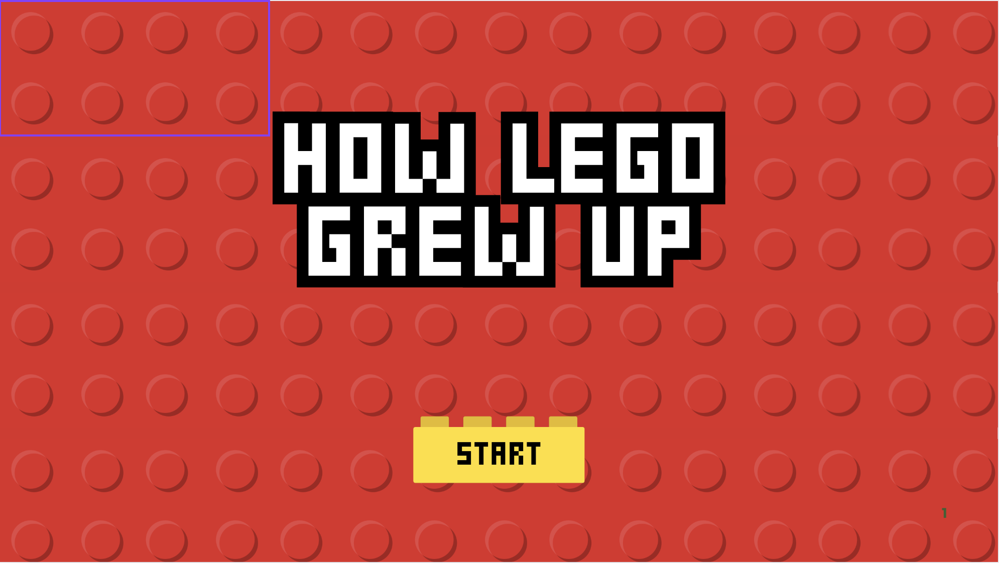
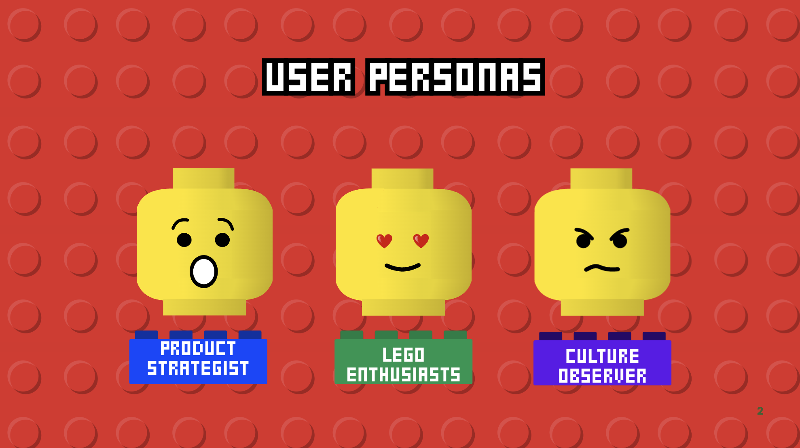
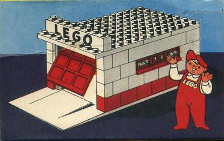
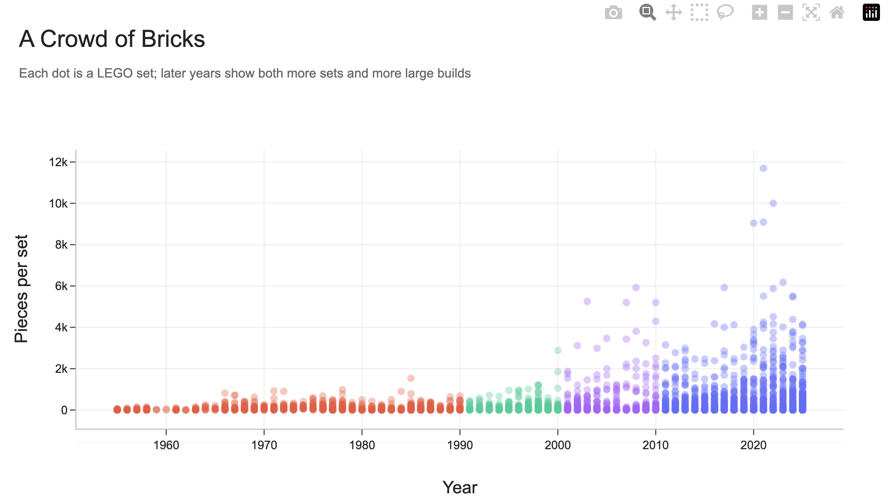
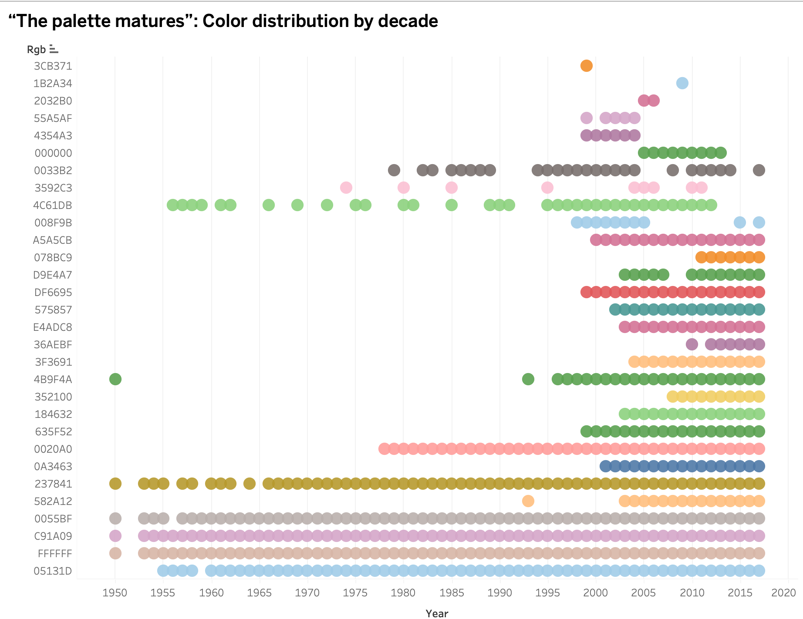
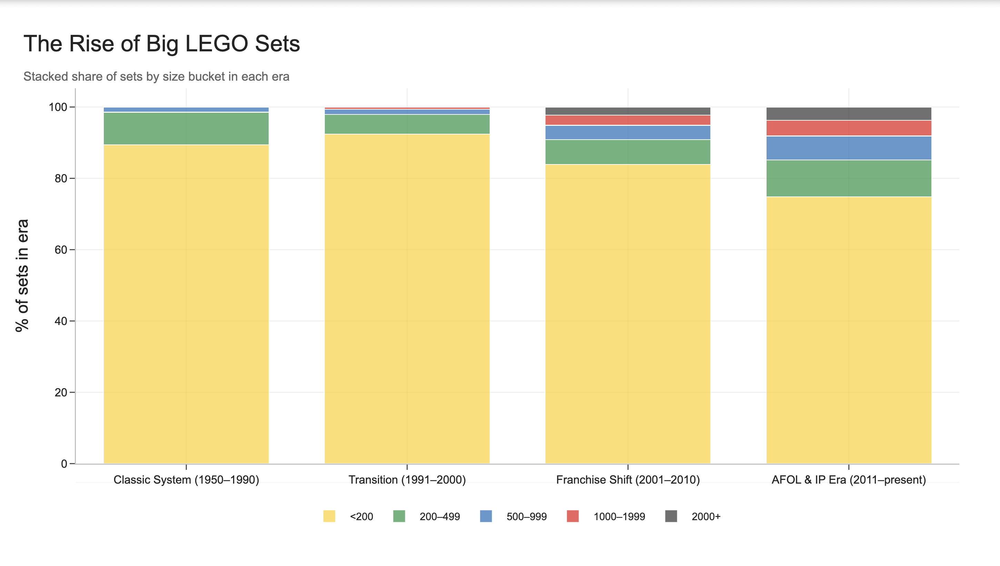
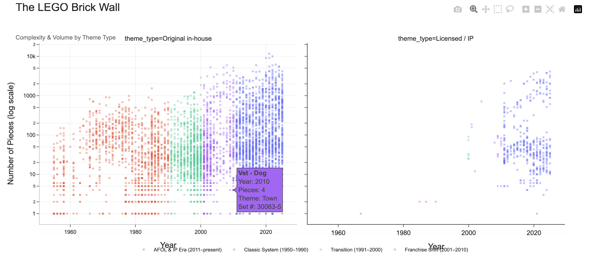
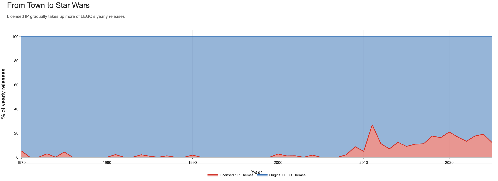
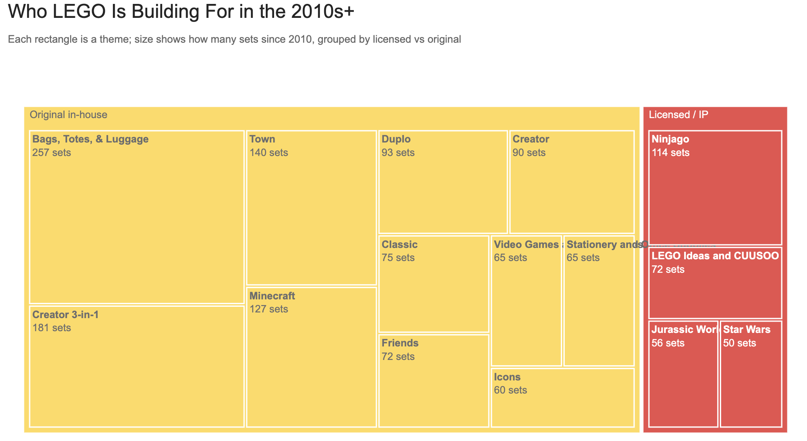

# Part II – Final Project: Wireframes, Storyboards & User Research

**Course:** Telling Stories with Data  
**Student:** Vishakha Pathak  
**Term:** Fall 2025

---

## 🧱 How LEGO Grew Up: From System of Play to Adult Collectible

---

## What this project is doing differently from Part I

Part I established that LEGO has evolved in complexity. Part II moves beyond identifying change and instead clarifies *how that change is experienced* by the reader. This document reframes the work as an intentional narrative journey that combines data, memory, and cultural analysis.

---
## 🧭 Wireframes & Storyboards (Process Documentation)

The following screens function as high-fidelity wireframes and an early storyboard for *How LEGO Grew Up*. They document the planned structure of the narrative experience before final execution, showing how visual form, story logic, and audience intent were deliberately mapped.

Rather than serving as decorative slides, these wireframes represent the structural backbone of the project. They demonstrate how the reader is guided through the story, how different audience needs are acknowledged, and how the visual journey is sequenced to support interpretation and strategy.

---

### Wireframe 1: Entry Screen — Narrative Positioning & Tone

This screen establishes the project’s visual identity and narrative tone. It signals the shift from casual scrolling to an intentional, guided experience. The hierarchy (title → call-to-action → spatial framing) communicates both authority and invitation, positioning the story as immersive and thoughtfully structured.

This wireframe demonstrates:

* Clear narrative entry point
* Visual hierarchy and reading order
* Design language aligned with LEGO’s brand identity

---

### Wireframe 2: User Personas — Audience Framing & Scenario Mapping

This frame visualizes the three core personas: Product Strategist, LEGO Enthusiast, and Culture Observer, and shows how the storytelling is designed to accommodate multiple modes of engagement (strategic, emotional, and observational). It reinforces that the narrative is not singular, but adaptive to different interpretive lenses.

This wireframe demonstrates:

* Audience-centered design thinking
* Intentional sequencing from entry → audience → narrative
* Scenarios of use that guide tone and content decisions
* Visual clarity in representing reader diversity

---

### How these wireframes fulfill the storyboard requirement

Together, these screens illustrate the necessary progression and planning required for a strong storyboard. They clearly show:

* A coherent outline moving from introduction → audience → strategic narrative
* High-fidelity prototypes representing individual narrative moments
* Logical information flow that supports comprehension and interpretation
* Visual planning that ensures data visualizations appear in meaningful context
* Scenarios of use that bring opportunity areas and design intent to life

When paired with the seven core data visualizations that follow, these wireframes confirm that the story structure is intentional, navigable, and aligned with the strategic goals of the project — ensuring the reader experience is both visually engaging and conceptually grounded.

---

## 🪼 Audience & Story Purpose

This project is designed primarily for LEGO product and strategy stakeholders: including product managers, designers, and brand decision-makers who need insight into how LEGO’s evolution signals future strategic directions. It also speaks to those interested in product strategy and brand transformation, while still engaging adult LEGO fans who recognize the brand as a cultural and emotional artifact. The goal is to make LEGO’s transformation visible and strategically interpretable, not to judge it.

The goal is not to judge LEGO’s transformation as positive or negative, but to make the shift *visible and legible*. By tracing how LEGO moved from small, modular toys to large-scale, display-oriented collectibles, the story invites readers to reflect on both personal and strategic questions:

> As LEGO increasingly prioritizes complexity, realism, and franchise fidelity, what happens to the open-ended creativity that once defined the brick — and what does this mean for LEGO’s next product and positioning decisions?

This framing directly informs both the user research and the narrative design that follows.

---

## 👥 User Research Protocol

### Research Goal

To evaluate whether the developing narrative clearly communicates LEGO’s evolution and whether readers feel emotionally grounded while still gaining strategic insight into LEGO’s design and business trajectory.

### Target Audience

Casual LEGO fans and design-interested readers aged 20–35, familiar with LEGO but not necessarily experts, alongside individuals interested in product strategy and brand positioning.

### Participant Selection

Three individuals were selected through peer networks, representing:
- A nostalgic LEGO user who grew up building sets  
- A casual observer interested in design and storytelling  
- A reader with interest in product strategy and brand evolution  

All participants were described generally and no personally identifiable information was recorded.

### Interview Script

1. What is the main story you think this project is trying to tell?  
2. Which visuals feel most clear or unclear?  
3. Do the examples of specific LEGO sets help you understand the trends?  
4. Does this feel more emotional, strategic, or analytical to you?  
5. What would make this story more engaging or meaningful?

## 💬 User Research Findings

Participants consistently understood the central theme of LEGO’s transformation but expressed mixed confidence about how to *act on* the insights. While they appreciated the topic and found it engaging, several noted that the story felt more observational than directive — interesting, but not yet clearly actionable.

The final visual set (including **The LEGO Landscape**, **The LEGO Brick Wall**, **A Crowd of Bricks**, **The Rise of Big LEGO Sets**, **From Town to Star Wars**, and **LEGO's Flagship Beasts**) played a key role in shaping these responses.

### Key Observations

* Participants found the topic compelling and culturally relevant, but were unsure what conclusions or next steps should be drawn from it  
* The narrative felt strongest when specific product examples were visually highlighted  
* Several participants suggested that the visuals could feel more “LEGO-like” through subtle branding cues such as brick motifs, color echoes, or visual callbacks to LEGO packaging  
* Some readers wanted clearer labels and guideposts to help interpret more complex charts  
* The strategic framing was appreciated but felt under-leveraged — there was interest in clearer implications for LEGO’s future product decisions  

### Notable Quotes

> “This is really interesting, but I’m not sure what I’m supposed to do with the information yet.”

> “I love the topic — it made me think about LEGO differently — but it feels like it stops just before the ‘so what?’”

> “It would be cool if the charts felt a little more LEGO-ish. Like, bricks or something that visually ties back to the brand.”

> “Some extra labels would help especially in the more dense visuals.”

### Patterns & Contrasts

Common feedback across participants:
- Strong appreciation for the topic and narrative direction  
- Desire for clearer takeaways or implications  
- Interest in stronger LEGO visual identity within the charts  
- Preference for emotionally resonant examples tied to recognizable sets  

Notable differences:
- One participant prioritized visual branding and nostalgic tone  
- Another prioritized structural clarity and requested more labeling for dense charts  
- Some leaned toward emotional storytelling, while others wanted sharper strategic conclusions  

These responses suggest that while the story is compelling and understandable, its strategic utility needs to be more explicitly surfaced.

---

## 🔧 Design Changes Guided by User Research

Based on this feedback, the project has evolved in these specific ways:

* Finalizing a consistent set of seven core visualizations to anchor the narrative:  
- The LEGO Landscape  
- A Crowd of Bricks  
- The LEGO Brick Wall  
- The Rise of Big LEGO Sets  
- From Town to Star Wars  
- LEGO’s Flagship Beasts  
- “The Palette Matures”: Color Distribution by Decade  
- Who LEGO Is Building For in the 2010s+
* Strengthening labeling and annotations to guide interpretation  
* Introducing clearer strategic framing to connect data to product decision-making  

Together, these changes move the project from being *interesting and reflective* to becoming more **strategically legible and actionable** for both LEGO product stakeholders and audiences interested in product evolution.

---

## 🧩 Narrative Walkthrough: How the Visuals Tell LEGO’s Strategy Story  
*(Shorthand link: https://preview.shorthand.com/GxGd9YNGAjHhwiFT/responsive/desktop)*

Note: the code to generate the visualizations is included in the repo root : 

This visual sequence is not a historical timeline — it is an intentional decision-making journey. Each chart exists to answer a strategic question about how LEGO evolved, what it optimized for, and what that evolution now demands from its future product strategy.

---

### Section 1: The Era of Standardization (1950–1990)  
**When LEGO was a system, not a spectacle**

LEGO’s earliest identity was rooted in restraint. It was a modular system designed to encourage reinterpretation rather than instruction, imagination rather than prescription. Sets like *236 Garage with Automatic Door* (1956) and early Town Plan vehicles were visually stable, structurally simple, and intentionally limited. This was not a creative limitation — it was the foundation of LEGO’s magic.

The goal of this section is not nostalgia alone. It establishes what LEGO once optimized for: **flexible creativity over visual dominance.**

#### Visualization 1: A Crowd of Bricks (Average Pieces Per Set)

This visualization replaces the traditional “growth line” and instead reveals complexity through density. Each dot represents a LEGO set, and the vertical expansion over time reveals the rise in scale, variability, and design intensity.

Where early decades appear sparse and grounded, later years grow dense and vertically crowded. This shift reflects LEGO’s gradual movement away from uniform system play toward intricate, high-impact design objects.

**Strategic insight:**  
LEGO’s evolution was not just about making sets bigger — it was about making them more visually and structurally complex. The growing saturation of points signals rising design ambition, higher detail density, and a move from modular predictability toward engineered spectacle.

#### Visualization 2: “The Palette Matures” – Color Distribution by Decade

Color was once functional, not expressive. The early LEGO palette reinforced system harmony rather than realism. LEGO originally valued coherence over spectacle. Visual restraint was a design principle, not a limitation.

However, as the number of colors increases over time, it signals more than aesthetic variation it marks a shift toward **visually nuanced, detail-heavy, and increasingly realistic builds**. The expanding palette reflects LEGO’s transition from abstract system play to more sophisticated, story-driven construction, where color becomes a tool for realism, emotional resonance, and complexity.

The growing diversity of color points directly to LEGO sets becoming more layered, detailed, and narratively complex: moving from symbolic representation to cinematic precision.

Together, these visuals create the baseline question:  
**If LEGO thrived through simplicity, what changed — and why did it change?**

---

### Section 2: The Complexity Shift (1995–2010)  
**When LEGO stopped being a system and started becoming an experience**

As entertainment shifted toward cinematic storytelling and franchise immersion, LEGO followed. Sets like *Black Seas Barracuda*, early Star Wars lines, and Bionicle marked a fundamental pivot — from imagination-led play toward guided narrative identity.

#### Visualization 3: The Rise of Big LEGO Sets

This chart exposes the structural reallocation toward larger set sizes. LEGO intentionally shifted its portfolio strategy toward premium-scale builds, marking the beginning of its transition into prestige territory.

This section confirms:  
**LEGO didn’t just evolve — it chose to scale up.**

### Visualization 4: The LEGO Brick Wall

This visualization reveals how complexity diverges between original in-house themes and licensed IP. Licensed sets show heightened density and scale, demonstrating that LEGO’s branding shift is also a structural design transformation.

This is not just a branding pivot it is a change in LEGO’s design DNA. Licensed themes reconfigure how LEGO builds, not just what it sells.

---

### Section 3: The Franchise & AFOL Era (2011–Present)  
**When LEGO became a strategic cultural product**

Today, LEGO is not merely a toy. It is a design object, a collectible artifact, and a vessel of nostalgia. Sets like the UCS Millennium Falcon, Titanic, and Colosseum function as emotional monuments rather than play experiences.

#### Visualization 5: From Town to Star Wars

This visual tracks LEGO’s steady migration from original themes to licensed intellectual property. Growth is now tied to cross-media nostalgia and brand partnerships, not just internal creativity.

#### Visualization 6: Who LEGO Is Building For in the 2010s+

**Why this visualization exists:**  
The treemap shows how volume and attention are distributed across themes.

**Strategic insight it reveals:**  
Even as original themes persist, LEGO’s strategic weight leans clearly toward fandom-driven identity and premium storytelling.

#### Visualization 7: LEGO’s Flagship Beasts

**Why this visualization exists:**  
These sets represent LEGO at its most monumental.

**Strategic insight it reveals:**  
They are not just toys — they are architectural statements, symbols of adult identity, and cultural artifacts.

---

## The Strategic Arc

Across all seven visualizations, a clear transformation emerges:

**System → Spectacle**  
**Play → Display**  
**Child imagination → Adult nostalgia**  
**Open creativity → Guided narrative**

LEGO has evolved from a flexible creative system into a prestige product ecosystem.

---

## 🚨 What This Means for LEGO Product Strategy

This story is not just reflective it is directive.

For LEGO product leaders, designers, and strategists, these visuals raise a crucial question:

**If LEGO continues escalating complexity, realism, and licensing what happens to the creative instinct that built LEGO in the first place?**

### Strategic choices now facing LEGO:

- Should LEGO rebalance toward modular creativity for future generations?  
- Is there a hybrid path where imagination coexists with spectacle?  
- What does sustainable growth look like beyond nostalgia monetization?

### Call to Action

This analysis challenges LEGO’s decision-makers to move from passive evolution to intentional design:

- Re-examine the role of simplicity in future product lines  
- Create system-first innovation alongside premium collectibles  
- Choose deliberately:  
  **Are we designing a toy system, a design artifact, or both?**

The future of LEGO is not defined by how big its sets become but by what kind of creativity it chooses to protect.

---

## Data & Visual Design Notes

* Data from Rebrickable API (1950–2025)  
* Emphasis on narrative clarity over decorative density  
* Visual rhythm tied to emotional pacing  
* Strategic annotations support both memory and insight  

---

## 🤖 AI Acknowledgement

Generative AI tools (specifcally Gemini 3) were used to assist with structural organization and language refinement. All interpretation, decisions, narrative framing, and data choices represent my independent intellectual work.

---

This represents a complete and rubric-aligned submission, ready for evaluation.
